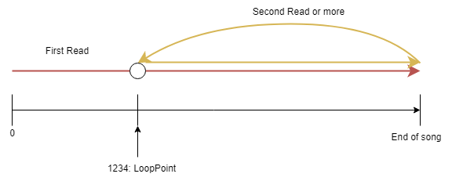
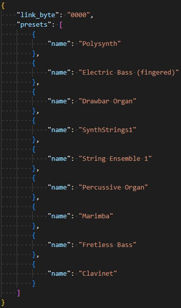
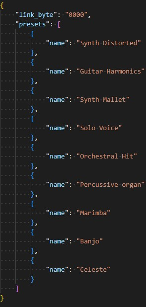

# Trezer: A MIDI to SMD file converter 

A MIDI to SMD converter, aimed solely for Pokémon Mystery Dungeon: Explorers of Sky.

This project is a Work In Progress and will probably not aim to be a refined, complete and accurate MIDI converter. It was mostly made out of curiosity.

The following will explain how one should use Trezer. The findings and methods used for conversion are mentionned in the TrezerChest file (unavailable now).

Please remember that the project is still rough on many edges
and is not trivialised. It is more of a prototype than a complete feature.

# Table of Contents
1. [What it does](#what-it-does)
2. [How to use](#how-to-use)
3. [TL;DR](#tldr)
4. [Limitations](#limitations)

## What it does

Trezer comes in currently 4 different steps to generate a complete song for Explorers of Sky, namely:

- Preset picking from an Explorers of Sky ROM
- MIDI parsing
- MIDI conversion to SMD
- SWD generation


SMD files, generated through MIDI files must be linked with a SWD file. Loosely speaking, SMD files holds "the notes" while SWD files holds "the instruments".

Trezer aims to create a SMD file and also try to generate a SWD file composed of "instruments" from the Explorers of Sky soundtrack.


## How to use

### Step 0: Requirements

The project being coded in Python, Python version 3.10 or above is mandatory.

The project also needs to take files from an unpacked Explorers of Sky ROM, which is obviously not provided here.

The project being built and used on Windows, compatibility with any other OS is unsure.

### Step 1: PresetFetcher

**Note:** This step should only be done:
- Upon the very first use.
- In the case the soundfont fetching gets updated
- To rebuild the directories content (in case of a deleted file for example)

The first step consist of taking most of the Presets and Samples from an Explorers of Sky ROM. More specifically, It takes these informations from the BGM directory found in the ROM.

To do so, execute `PresetFetcher.py` while giving as argument the path to the BGM file.

```console
python PresetFetcher.py BGM
```
The directory, to be accessed, must be unpacked from an EoS ROM.

After execution, the SAMPLES and PRESETS directories should contain multiple files.

### Step 2: MIDIparse

The second step consists of parsing a MIDI file, and to give as output a plaintext file, holding the relevant MIDI instructions for the next steps.

To do this, execute `MIDIparse.py` while giving as arguments:

- The path to the MIDI file you want to convert
- A name for the text file generated

```console
python MIDIparse.py best_music.mid music_name
```

After execution, a text file will be written in the MIDI_TXT directory. For example, from the above command, a file named `music_name` would be generated, based on the `best_music.mid` MIDI file.

The text file is in plaintext, but a `.txt` extension is not needed to be specified (though recommended, if you want to dwell in said file)

#### The `--loop` option

When a song is finished, it will loop back to the beginning.
Some songs though may have an "opening" part meant to be heard only once.

A loop option can be added on the command line, that will change the loop position of the song.

To add that option, add `--loop` to the MIDIparse command line.
This option must be provided with a value: at what time should the song loop back to.

```console
python MIDIparse.py best_music.mid music_name --loop 1234
```

With this command, when the song finishes its first read (from 00:00 to the end) the song will loop back 1234 ticks from the start of the song.



**Note:** Due to a limitation, the value of the Loop beginning must be given in MIDI ticks (definitely not because I'm lazy).

### Step 3: MIDIconvert

The third steps consist of converting the file we created in step 2, into an `.smd` file that can be added to the ROM.

To do this, execute MIDIconvert.py while giving as arguments:
- the name of the instruction file made in step 2
- the name of the `.smd` file to generate

```console
python MIDIconvert.py music_name bgmXXXX
```

This command will parse and convert the MIDI instructions from `music_name` located in the MIDI_TXT directory and will create:

- A `.smd` file called `bgmXXXX.smd`
- A `preset_output.json` file
- A directory `bgmXXXX` containing both files

The directory `bgmXXXX` will be located in the SMDS directory.

#### Preset output

Upon executing MIDIconvert, a .smd and a .json file will be generated.
The .json file will hold a list of presets used in the .smd file generated. It will also hold the value of the link byte.

The list of presets holds names, which are the name of the instrument that will be used by the .smd file.



This file is up to you to edit, by putting the names of the instruments you want the song to use.

Available instruments and their names can be found in the PRESETS directory. The names used are the one from the [PMD soundfont made by StaticR.](https://t.co/FK6WCxbQk4)

#### The `--linkbyte` option

The link byte is the name given to the two bytes that links a .smd and .swd file. This value must be shared by these two files for the song to work.

the `--linkbyte` option allows you to change the value used for the .smd generated, and the value given in the .json file

```console
python MIDIconvert.py music_name bgmXXXX --linkbyte '1f2d'
```

The purpose of these two bytes is not really known so it is available to editing, just in case. The value by default is `0000`.

#### The `--pmd-soundfont` option
After execution, a `preset_output.json` file is given.

The list of presets that will be used are given with defaults names.
The names in questions are from the GM MIDI soundfont.

The option `--pmd_soundfont` will change the names given in the .json file to match the PMD soundfont name convention.




Above is the same file as prior, but with the PMD soundfont counterparts.

With this option, you would technically would not need to edit this file (although still very recommended).

If the MIDI file used the PMD soundfont as a base, hopefully this option will give the very same instruments that were used in the MIDI file.(Although it is untested.)

### Step 4: SWDgen

After editing the `preset_output.json` to your liking, the enxt step is to make a .swd file from it.

To do so, execute `SWDgen.py` with the name of the .smd file as argument

```console
python Swdgen.py bgmXXXX
```

SWDgen will browse the `bgmXXXX` directory (located in SMDS/), will read the `preset_output.json` of this directory and will create `bgmXXXX.swd` on that directory.

Note that the presets added to this .swd file should be the one named on the .json file.

As of now, many presets from the PMD soundfont are still not available. A quick glance at the PRESETS directory should tell you if it is added or not.

## TL;DR

In short:

1. Use on a Command Line Interface
```console
python PresetFetcher.py BGM
```
BGM being the path to the BGM directory of the unpacked EoS ROM
(command above used only once)


2. Use on a Command Line Interface
```console
python MIDIparse.py kraken_of_the_sea.mid fancy_name
```
Will create a `fancy_name` file in MIDI_TXT directory

3. Use on a Command Line Interface
```console
python MIDIconvert.py fancy_name bgm0016
```
Will create a directory bgm0016 (in SMDS directory) with inside:

- bgm0016.swd
- preset_output.json


4. Edit the presets names from .json file

(preset names should match the PMD soundfont/the names in PRESETS directory)

5. Use on a Command Line Interface
```console
python SWDgen.py bgm0016
```
Will make `bgm0016.swd` in the bgm0016 directory based on `preset_output.json` of the bgm0016 directory


6. Then, add bgm0016.smd and bgm0016.swd to the BGM directory (the EoS one)
7. Repack the ROM.
BGM 16 is now the song that you added
8. Cross your fingers and listen to it. Then either:
- Edit the .json and repeat steps 5 to 8 until it sounds good
- Be sad because the game crashed.

Both `.smd` and `swd` should have the same name and of the form `bgmXXXX` to work in EoS (I think).

## Limitations

1. The .swd can only use the PMD soundfont available in the PRESETS directory.
2. The presets used are fixed on parameters like volume and samples used.
3. Many presets are still missing or are incomplete
4. MIDI files of format 2 is not supported
5. Loops are still wacky (Some Instruments does not resets)
6. .swd files are fairly unstable and prone to crash